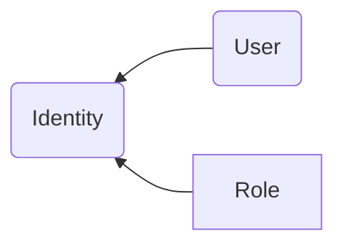

# Definition
- User or role

# Definition
denotes a **human identity** like
  - people
  - administrators, developers, operators
  - consumers of applications

that need to access AWS environments, resources, applications of 1 company via
- browser (http request)
- Client App (SDK)
- Interactive Shell using an (aws cli)

# Type

# Member
- 1 set of permissions policies that determine what the identity can and cannot do in AWS

# Classification
- can be 1
  - user (`iam`)
  - role (`iam`)
  - group of users
- human identities

# Process
Access to `AWS` resources in `AWS` is managed the following way:
1. create policies
1. bind them to identities or `AWS` resources

# To know
- policies@`Iam`  cannot be used to explicitly deny access to resources
- Only AWS Organizations service control policy (`SCP`) can limit
  - the accesses to resources
  - the permissions
# Operation
- You cannot create Identity instead you
  - Create user
  - Create role

# Todo
Connect to 1 organization:aws (via internet) with 1 id@sdef (the org:id) and N role@udef (ie Entry role that allow to endorse other role). Example
  - arn:aws:iam::394683156080:role/datahub_cfdi_readonly
  - arn:aws:iam::394683156080:role/datahub_cfdi_readwrite
 - arn:aws:iam::394683156080:role/devops_ccfproxy is now unset

Endorse a role inside this organisation 

# Todo
- create one mxr_erole (ie. empty role)
- this erole can only:
  - connect to AWS
  - assume other roles