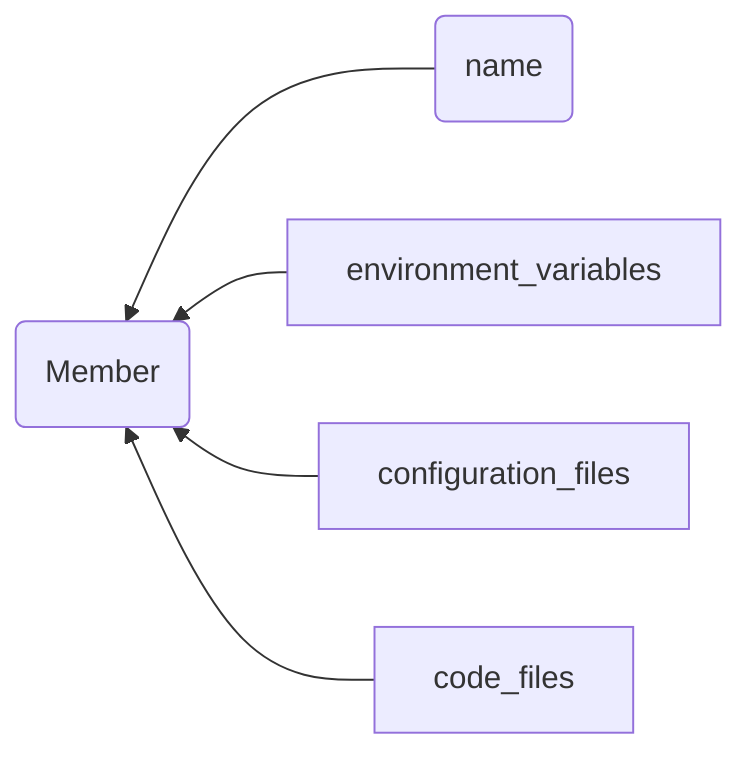

# definition
## synonym
- software
- application
- service
- Api

# Type

- GUI
- CLI
- API
- SDK

# Member

```mermaid
graph RL;
 Id01(name)-->Id00(Member);    
 environment_variables    -->Id00;    
 configuration_files  -->Id00;    
 code_files  -->Id00;    
```

# List of cloud
- aws
- gcp
- oracle oci

