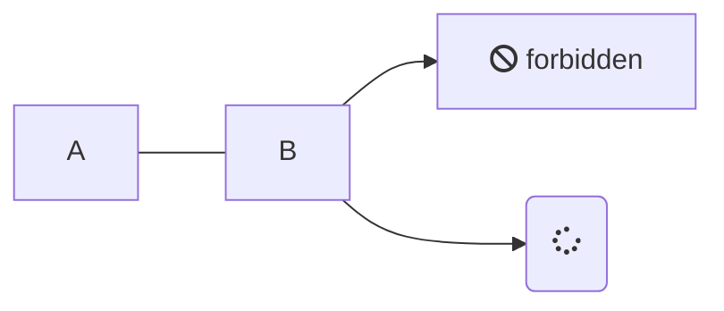
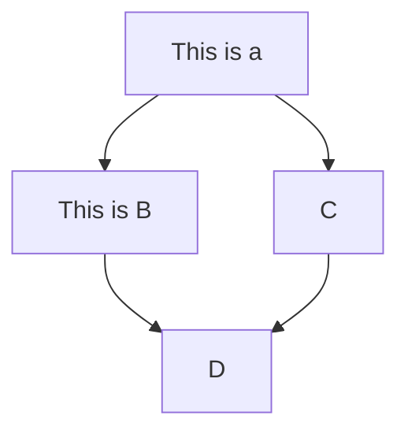
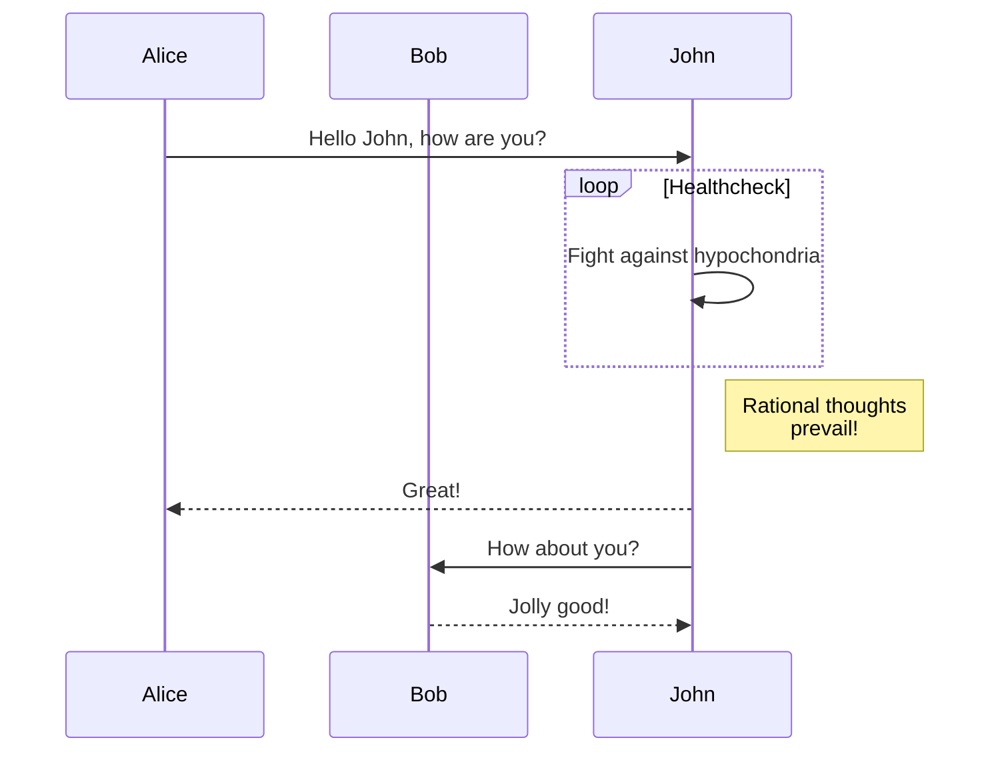
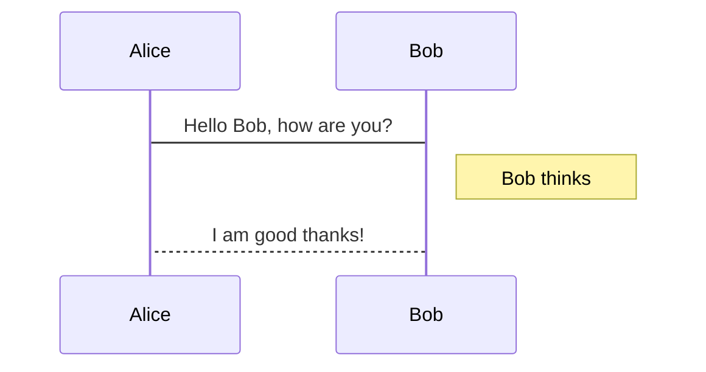
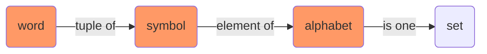
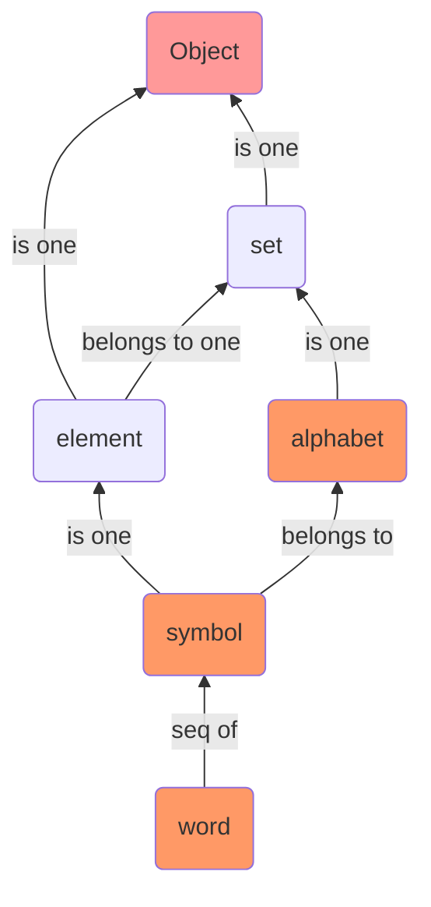

---
---

## Mermaid

### Example

```mermaid
graph LR
    A --- B
    B-->C[fa:fa-ban forbidden]
    B-->D(fa:fa-spinner);
```

### Example

```mermaid
graph LR
    fa:fa-check-->fa:fa-coffee
```

```mermaid
graph TD;
    A[This is a]-->B[This is B];
    A-->C;
    B-->D;
    C-->D;    
```

```mermaid
sequenceDiagram
    participant Alice
    participant Bob
    Alice->>John: Hello John, how are you?
    loop Healthcheck
        John->>John: Fight against hypochondria
    end
    Note right of John: Rational thoughts <br/>prevail!
    John-->>Alice: Great!
    John->>Bob: How about you?
    Bob-->>John: Jolly good!
```

## Sequence

```mermaid
sequenceDiagram
Alice->Bob: Hello Bob, how are you?
Note right of Bob: Bob thinks
Bob-->Alice: I am good thanks!
```

# Example

```mermaid
graph LR;
  classDef tobject fill:#f96
  classDef robject fill:#f99

  id03(alphabet):::tobject -- is one      -->id01(set);    
  id05(word):::tobject     -- tuple of -->id04(symbol):::tobject;    
  id04                     -- element of  --> id03;    
```
# Example

```mermaid
graph BT;
  classDef tobject fill:#f96
  classDef robject fill:#f99

  id01(set)                -- is one     -->id00(Object):::robject;    
  id02(element)            -- is one     -->id00;
  id02(element)            -- belongs to one-->id01;
  id03(alphabet):::tobject -- is one     -->id01;    
  id04(symbol):::tobject   -- is one     -->id02;    
  id05(word):::tobject     -- seq of     -->id04;    
  id04                     -- belongs to --> id03;    
```
