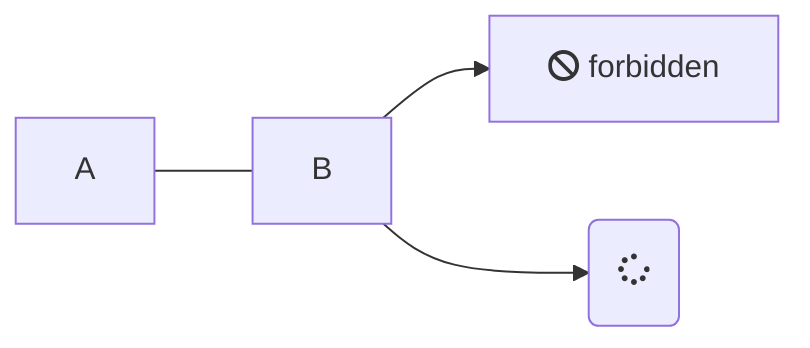
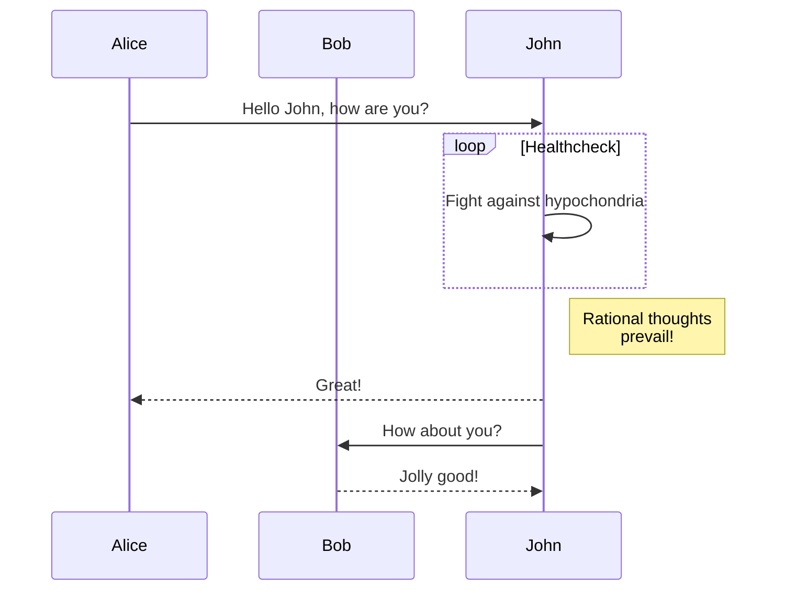
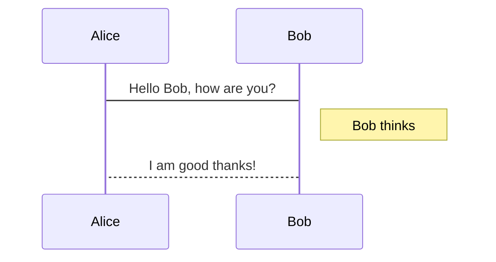
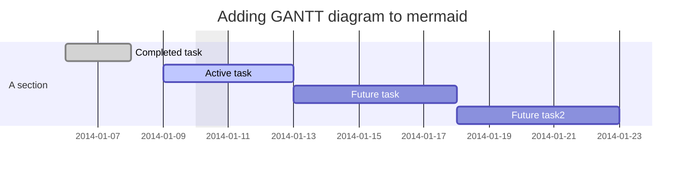
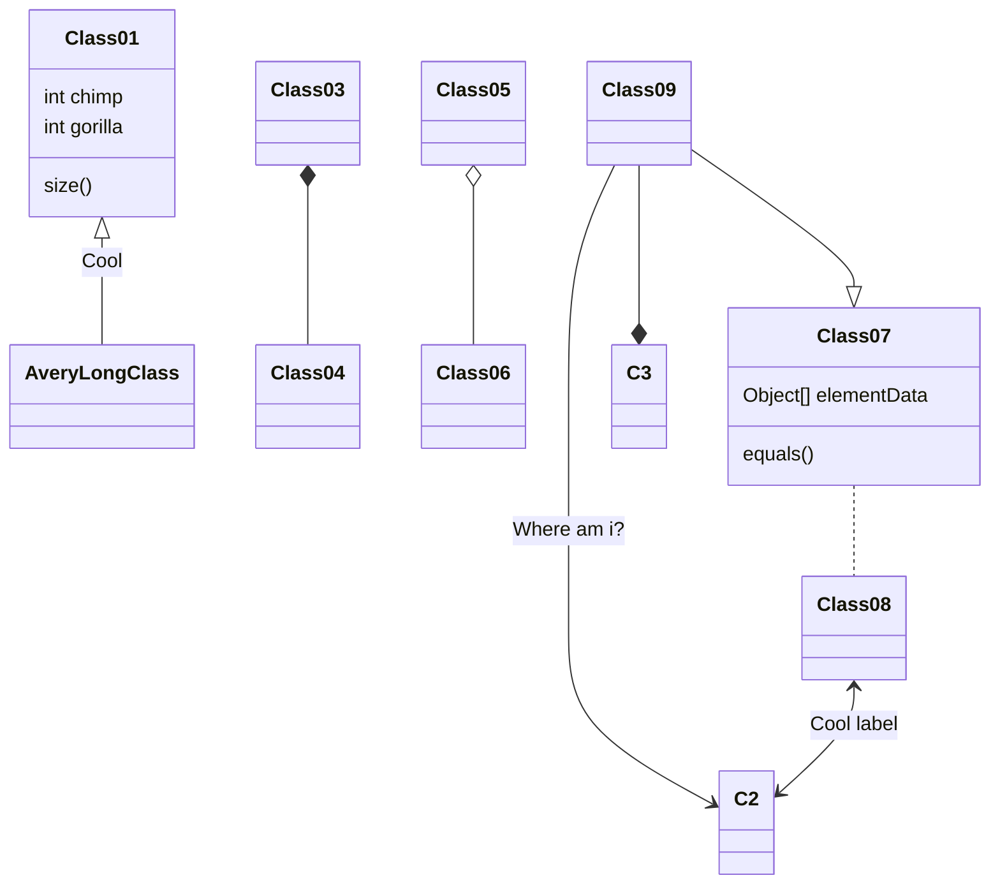

---
---

## Mermaid

### Example


### Example




### Example


```mermaid
sequenceDiagram

Browser->>Alb:send request on :443
Alb->TargetPool:send request on :8080
TargetPool->VmX:send request on :8080
VmX->Vmx_CFront_Apache:send request on :8080
Vmx_CFront_Apache->Vmx_CBack_Node:send request on :3000
Vmx_CBack_Node<-->Rds:communicate
Vmx_CBack_Node->Vmx_CFront_Apache: send response
Vmx_CFront_Apache-->Browser:send response


note over Browser,Vmx_CFront_Apache:React Code 
```


### Example





### Example


# List of references
- Vscode > extension > Mermaid
- https://mermaid-js.github.io/mermaid/#/