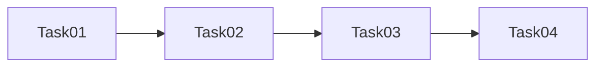
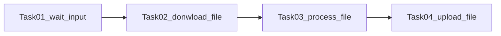

# Type
- at runtime
- static
# Member
- status (running, failed, stop, history, ...)

# Dag
- need strong python skills
- is1 acronym
- denotes, represents 1 *workflow*
- is1 sequence of tasks
- is launch 
  - at a regular basis
  - via 1 trigger
- is saved in airflow:db
# Representation

## example

# Dag Run
- is1 instantiation of the DAG (in time)

# Toknow 
- Any time 1 DAG is executed, 1 DAG Run is created and all tasks inside it are executed
- 1..N Dag can runs at the same time

# Status
Can be:
- *success* if all of the leaf nodes states are either *success* or *skipped*,
- *failed* if any of the leaf nodes state is either *failed* or *upstream_failed*.

# Example
- Run a Spark job
- Move data between two buckets
- Send 1 email