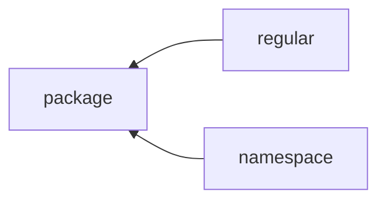

<head><link rel="stylesheet" href="../../../../md.css"/></head>

[//]: #(Reference)
[Repo_Readme]:    ../list/object_list.md
[Item_Howto]:    ../howto/package_howto.md

[Module_Whatis]:  ../whatis/module_whatis.md
[Setuppy_Whatis]: ../whatis/setuppy_whatis.md

# [&larr;][Repo_Readme]Domain > Language > Python > Whatis > package ([Howto][Item_Howto])
# List of references

|name|type|learning path|sequence|view|desc|
|-|-|-|-|-|-|
|module||||[Definition][Module_Whatis]||
|setup||||[Definition][Setuppy_Whatis]||

# List of references
|name|type|learning path|sequence|view|desc|
|-|-|-|-|-|-|
|module|
|search path|
|repository|
 

# Definition
a hierarchy of folders containing 
  - file@txt
  - python:modules

## Menber
- python:modules
- a file named `__init__.py`

# Operation
- install
- create
- import module from package
- query
  - location
  - existence
  - ... (other property)

# To know
- a package 
  - can exists by default (ie. created/installed at python install)
  - may need to be installed via a package manager
- a package:module 
  - need to be imported by a consumer code that want to use it

# member
- root folder:file:  `__init__.py` (which can be empty) to indicate the folder should be treated as a package

# type

# Package@Regular
contains 1 file named `__init__.py` (usually empty) that
  - can defines objects
  - said it is 1 python package
  - without this files we cannot make *from mypath import module*

