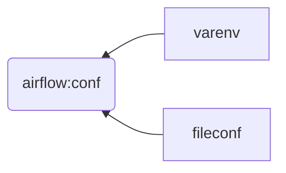

<head><link rel="stylesheet" href="../../../md.css"/></head>

[//]: #(Reference)
[Repo_Readme]:    ../README.md
[Dag_Whatis]:  ../whatis/dag_whatis.md

# [&larr;][Repo_Readme]Airflow > Howto > manage > conf
# List of references
|name|type|learning path|sequence|view|desc|
|-|-|-|-|-|-|
|Dag|see|[Definition][Dag_Whatis]|-|


# do not load example
```bash
# cfg
load_examples = False
# varenv - before init db
export AIRFLOW__CORE__LOAD_EXAMPLES=False

```

# Configuration

## howto
```bash
# fileconf
[core]
sql_alchemy_conn = my_conn_string

==

# envar - $AIRFLOW__{SECTION}__{KEY}
export AIRFLOW__CORE__SQL_ALCHEMY_CONN=my_conn_string
```
