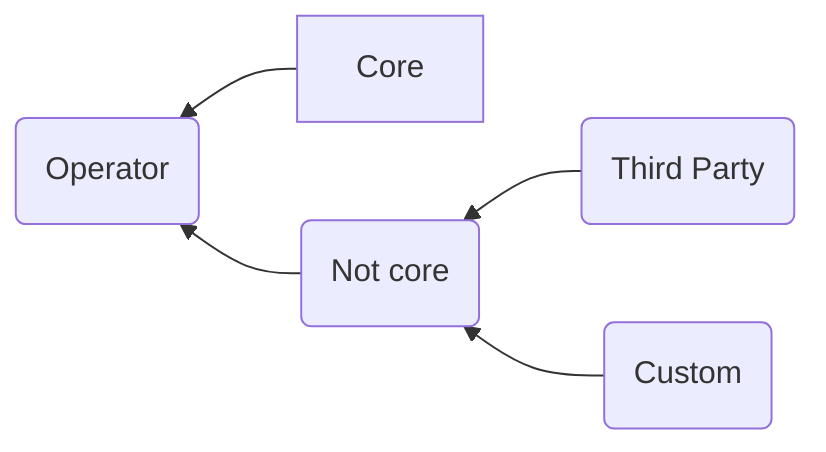
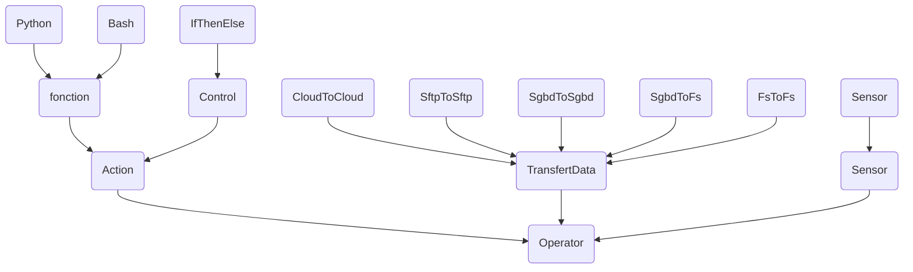

<head><link rel="stylesheet" href="../../../md.css"/></head>

[//]: #(Reference)
[Repo_Readme]:    ../list/object_list.md
[Operator_List]:    ../whatis/task_whatis.md

# [&larr;][Repo_Readme]Airflow > What is > Operator
# List of references
|name|type|learning path|sequence|view|desc|
|-|-|-|-|-|-|
|Operator|see|[Definition][Operator_List]

# Category

# Category

- Sensor = Trigger when 1 eve is triggered. Eve can be
  - end of 1 task execution of another Dag
  - 1 file just exist in 1 folder

# Definition
- denotes, 1 type of code

# Toknow
 - un operator est tout simplement une classe Python héritant de BaseOperator
 - Lorsque qu'une tache est appelée, la fonction execute() de l’operator est exécutée.
 - un *operator* instancié devient donc une *task*
 - a custom operator has a method:execute()