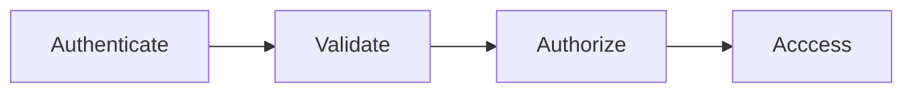

<head><link rel="stylesheet" href="../../md.css"/></head>

[//]: #(Reference)
[Repo_Readme]:       ../README.md
[Object_List]:       ./list/object_list.md
[Reference_List]:    ./list/reference_list.md

# [&larr;][Repo_Readme]Hashicorp Vault
# List of references
|Name|Order|Seq|View|Description|
|-|-|-|-|-|
|Object|||[Object][Object_List]|List of Object
|Reference|||[Reference][Reference_List]|List of external references
 

# Definition
- Is1 Cli/Server App from Hahsicorp
- Is written in Go
- Manage secrets (eg login:name, login:pwd, ssh keys, Git access token ,...)
  - store and retrieve secrets
  - can generate credentials on demand for some system
    - ssh kvpair
    - aws credentials
      - aws:kvpair to conect to ec2
      - aws:credentials to request aws:api  
- Can be managed via Cli, Api, Gui
- Allow to
  - centralize secrtes in 1 place
  - encrypt data in that place
  - define ACL to theses secrets (which user/app can access which secrtes)
  - encrypt as a services (ie manage encrtpion key lifecycle)

# Process
## Step
- Client request the server
- server communicate with
  - backend
  - data storage

## Use case
- user:Devops write secrets to Vault THEN
- App read secrets from Vault

## Step

Authentication
- Create 1 Vault token
- associate the token to 1 policy

Validation
- validate the client that provide the token against 1 trusted source (eg git, ldap, AD, ..)

Authorization
- define via policy associate to token which (cli, gui:action, api) is accessible
- define path and verb

Access
- allow user to access what he is granted to

# Toknow
- Secrets written to vault backend are encrypted, may it be 
  - txt file
  - db
- Vault allow to view and display this secrets via its client

